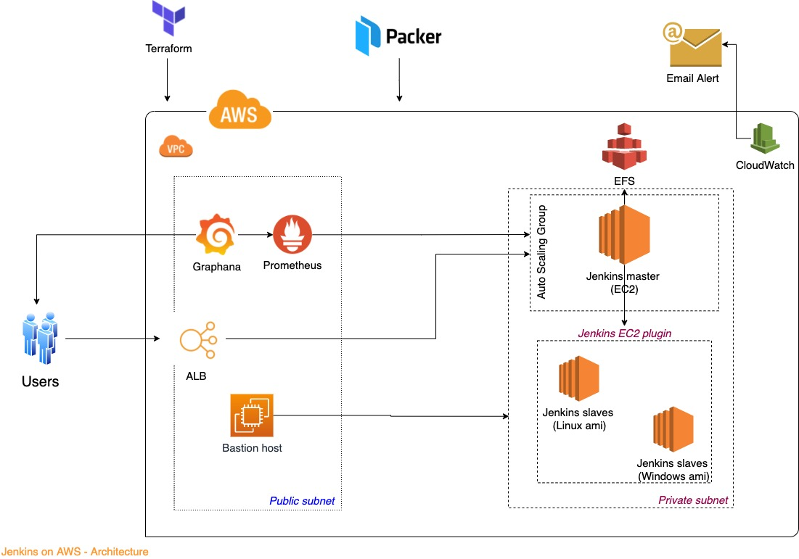
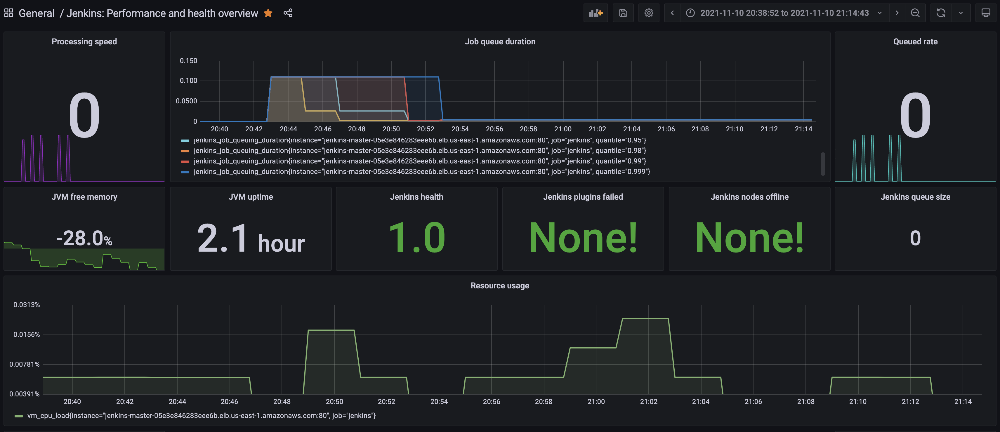

# Setting up scalable Jenkins using Terraform on AWS

## Repo consists Terraform and Packer code for setting up Scalable Jenkins in AWS. 

- Base AMIs for Jenkins Master and Slaves are created using Packer
- Infrastracture on AWS is set up using terraform
- Slaves are dynamically created using Jenkins EC2 plugins
- Jenkins health metrics is captured using Prometheus and the metrics data is used to build dashboard in Grafana
- AWS CloudWatch is configured to Scale up Jenkins master in case of high cpu utilization and send email alert
- A sample application and Jenkinsfile is used to create a job in Jenkins.

## Getting Started

### Build Jenkins Master and Slave AMIs using Packer
 - AMI for Jenkins master contains jdk and git
 - AMI for Jenkins slave consist git, maven & other required tools to build maven project

### Build Jenkins
 - [terraform-vpc](terraform-vpc)
	- VPC with 3 public and 3 private subnets is created in US East 1
 - [terraform-jenkins](terraform-jenkins)
	- Jenkins master is created using the base ami created using [packer-templates](packer-templates) on private subnet

### Build Prometheus and Grafana using Packer
 - Configure Prometheus to get metrics from Jenkins
 - Add Prometheus data source to Grafana
 - Build Jenkins Performance and Health dashboard in Grafana

## Links
 - [Jenkins](http://jenkins-master-05e3e846283eee6b.elb.us-east-1.amazonaws.com/)
 - [Grafana](http://54.144.246.246:3000/d/NCqnqSc7z/jenkins-performance-and-health-overview?orgId=1)

### Architect Diagram

### Jenkins Performance and Health Dashboard

